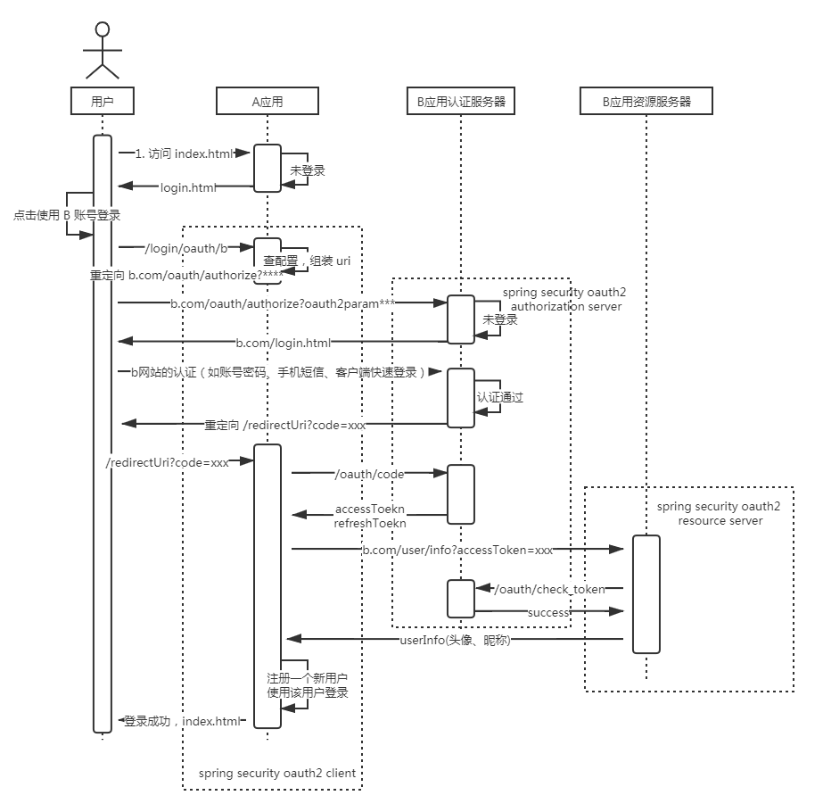

# 本项目旨在学习 spring security

- 介绍 `Spring Security`的设计
- 快速了解常见认证、授权机制， `oauth2.0`、`JWT` 等
- 学习 `Spring Security` 的使用
- 学习如何利用 `Spring Security` 快速实现认证授权机制
- 基于 `Spring Security` 实现一个可复用的脚手架，帮助项目完成快速开发。

## 本项目做出来的脚手架是什么

可以理解为：默认提供一系列基于 spring security 的功能实现，使用者直接引入该脚手架，即可实现基本的认证授权功能，也可以替换为自己的实现。

（该脚手架不会强制项目依赖脚手架中的类，使用者在使用时，也是依赖 spring 中的）

**OAuth2.0 流程（本脚手架选用的授权方案）**

## spring 版本选型：

- spring：5.2.3.RELEASE
- spring boot：2.2.4.RELEASE
- spring cloud：Hoxton.SR1
- spring security：5.2.1.RELEASE

（2020/02/02 最新的 GA 版本）

## 学习该项目能得到什么

- 演示如何使用并扩展 spring security 的功能
    - 使用自己的数据库的 user 表完成登录
    - 扩展认证方式，支持短信验证码登录
    - 扩展验证码功能，并提供出可复用的 starter
    - 编码规范、带有较为完善的注释
    
- 使用 spring 提供的 oauth2.0 认证
    - 实现类似 QQ、微信、微博、支付宝、github、gitee 等第三方登录
    - 实现授权服务器、资源服务器，允许第三方应用通过本系统的账号访问他们系统

- 介绍必要的知识
    - oauth2.0 讲解，各种授权模式，区别等
    - IAM 领域术语介绍
 
- [介绍与 spring security 相关的项目，这些 spring 的项目是干什么的，有什么区别，是否被废弃](spring-intro.md)
    - spring-boot 的 oauth
    - spring-cloud-security
    - spring-cloud-oauth
    - spring-security
    - spring-security-oauth
    - spring-social

- 演示在不同的项目里如何使用本项目写好的可复用模块（像spring-boot一样开箱即用）

- 在公司生产级别新项目里如何进行技术选型

## 模块介绍
- learn-security-core
    - 本脚手架通用的定义，以及通用的 spring security 的配置
- learn-security-code（开发 spring security验证码sdk 的 sdk）
    - 验证码的基本定义，可以基于这个包轻松实现支持 spring security、低耦合的自定义验证码，如手机短信验证码、图片验证码等
    
- learn-security-starter-code（默认提供的 验证码 sdk）
    - 基于`learn-security-code` 实现了简单的手机短信验证码、图片验证码验证方式
    
    
- learn-security-browser（开箱即用的 starter）
    - 对于面向浏览器项目的封装，访问方为浏览器，如果你项目里用到了 session、cookie，则可以直接引用这个包
    
- learn-security-app（开箱即用的 starter）
    - 对于面非浏览器项目的封装，前后分离项目，如访问方可能为 nodeJs、App、微信小程序等，则可以直接引用这个包
    
    
- demos（示例工程）
    - learn-security-demo
        - 使用本脚手架提供的 starter 快速开发项目、并演示如何自定义提供脚手架中提供的部分
    - auth-sever 
        - 基于 spring security oauth 实现的授权服务器
    - auth-resource-server
        - 基于 spring security oauth 实现的资源服务器
        
        
- 企业级认证中心一般包含点
    - 提供认证功能（统一返回 access_token、refresh_token）
        - 作为 oauth2-auth-server
            - 自身系统账号密码登录
            - 自身系统手机短信登录
        - 作为 oauth2-client
            - 第三方（如QQ、微信等）登录
        
    - 提供单点登录服务

## 补充 **[Shoulder-Framework](https://github.com/ChinaLym/shoulder-framework)**（[gitee](https://gitee.com/ChinaLym/shoulder-framework)）
该项目代码未来将作为`安全与认证`部分合并入 **[Shoulder-Framework](https://github.com/ChinaLym/shoulder-framework)**（[https://github.com/ChinaLym/shoulder-framework](https://gitee.com/ChinaLym/shoulder-framework)） 

`shoulder-framework` 是什么？
- `Spring Boot` 常用功能插件
- Java 快速开发脚手架
- 优雅设计落地

    
