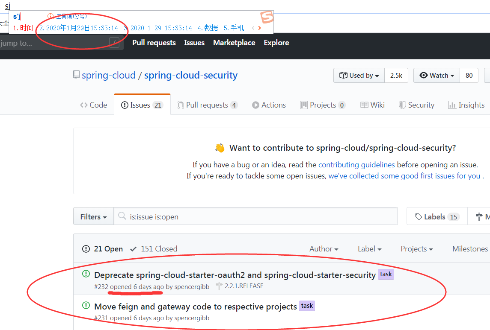

# spring security 相关技术选型：

由于 spring security 使用广度不及 spring boot，且 spring 这两年废弃了许多项目，spring 的术语和称呼都有一些改变。
网上看到的一些教程大多是过时的，2019年之前的文章、教程大都跟不上最新的潮流，2019的文章和教程大部分又是转载的前几年的，因此需要看 spring 官方文档。
由于 spring 官方看起来也需要时间，因此特作此说明，以减少各位技术leader和爱好者们在项目的技术选型中花费的时间。

先上结论： 
- 优先选择 Spring 官方推荐的 spring security 5.2.x +
- 生产环境版本优先选择次最新版的最新的 SR，如当前最新是 H 版本，用于生产追求文档则用 G 版本的最新 SR(官方标注GA的版本)，较长工期项目直接上最新版最新SR

我的猜测：Spring 官方未来会废弃一切与 security 相关的子项目并迁移至 Spring Security 中，
若未来想在 Spring 中寻找与`安全`、`认证`、`授权`相关的部分，只需学习 spring security 即可。

- 在 `spring security 5.3.x` 前可以有选择的使用 `spring-security-oauth`（一年内不会被淘汰，未来终将被 spring security5.x取代）

- 不要再使用 `spring-security-xxx`、`spring-social`等

- 不推荐使用 `spring-cloud-starter-oauth2`、`spring-cloud-starter-security`（有计划被废弃）

## spring-cloud-security

该工程中，包含4个模块，一个依赖管理，一个基础模块，两个 starter（`spring-cloud-starter-oauth2`、`spring-cloud-starter-security`）

- 好多教程中引入了 `spring-cloud-starter-oauth2`、`spring-cloud-starter-security`依赖，我要使用吗？
- [查看 spring-cloud-security 发布规划](https://github.com/spring-cloud/spring-cloud-security/issues)
得知 `spring-cloud-starter-oauth2`、`spring-cloud-starter-security` 在2.2.1版本（对应 spring-cloud Hoxton.SR2）将废弃，因此不再建议使用，



- [spring-cloud-security 的官方文档](https://spring.io/projects/spring-cloud-security) 中的 [sample （示例）部分](https://spring.io/projects/spring-cloud-security#samples)
提供的4个例子都是 5 年前提交的，用的还是 spring-boot-1.x

既然两个starter都没了，除了依赖管理模块，只剩一个`spring-cloud-security`，那么要不要继续使用 spring-cloud-security 呢？
看一下他的[源码](https://github.com/spring-cloud/spring-cloud-security/blob/master/spring-cloud-security/src/main/resources/META-INF/spring.factories)，
发现其实该模块就提供了3个功能，也没几个类，因此即使依赖也没有任何关系，也十分容易迁移或者适配，
所以我的建议是推荐不用，用了也无妨。
可以预见到，Spring官方未来会废弃一切与 security 相关的子项目并迁移至 Spring Security 中，
废弃spring-cloud-starter-security\oauth 迁移至 spring boot 中
但spring 官方还没有正式出废弃 `spring-cloud-security` 的通知，
也没出迁移 spring-cloud-security 到 spring-security 5.2.x 的说明文档，
况且它本身的代码和功能不多，暂时使用也无妨。


## spring-security-xxx 系列

结论：该系列项目均停止维护，新项目中直接考虑使用 [spring-security](https://spring.io/projects/spring-security) 5.2.x+即可，因为这些项目提供的主要功能集成进 spring security 中了
[github: spring-security 5.2.0.RELEASE](https://github.com/spring-projects/spring-security/tree/5.2.0.RELEASE)

### spring-security-oauth 
该项目是spring-security-xxx 系列中使用最广的项目，2年前 spring-security-oauth 是 spring 提供的 oauth 的解决方案，为什么现在不推荐使用了呢?

- [spring-security-oauth 官方](https://projects.spring.io/spring-security-oauth/docs/oauth2.html) 推荐使用 spring security 5.2.x + 替代 spring security oauth
- [spring security oauth 部分文档](https://docs.spring.io/spring-security/site/docs/current/reference/htmlsingle/#oauth2login)
- 该项目的最后一次提交是2019年11月左右
- [如何从 spring-security-oauth 2.x 迁移到 spring security 5.2.x](https://github.com/spring-projects/spring-security/wiki/OAuth-2.0-Migration-Guide)
- [Spring Security OAuth 2.0路线图](https://spring.io/blog/2019/11/14/spring-security-oauth-2-0-roadmap-update) 表示
    Spring Security OAuth 已经进入维护模式，未来会全部迁移至 spring security 5.x
    其2.3版本将于2020年3月停止开发，
    当spring security与Spring Security OAuth的功能一致后，停止2.4.x版本的开发，
    因此推荐使用spring security5.2+
- [spring 下一代 oauth2](https://spring.io/blog/2018/01/30/next-generation-oauth-2-0-support-with-spring-security)    
- [spring 中与 oauth 相关项目功能一览 ](https://github.com/spring-projects/spring-security/wiki/OAuth-2.0-Features-Matrix)
- [相关 issue](https://github.com/spring-projects/spring-security/issues/6733)
- 授权服务器迁移？spring-security-oauth 提供了授权服务器的能力，而 spring security5.2.x中没有对应的支持，官方表示至少5.3.x会支持授权服务器
- spring security 5.3.x 大概在2020年中旬发布
- [github上对授权服务器的支持讨论](https://github.com/spring-projects/spring-security/issues/6320#issuecomment-564151705)
    
该项目提供的能力逐渐由 spring-security 接管，并置于`spring-security-oauth-xxx`模块中

如果想使用该项目，在spring boot 中比较合适的jar如下：
```xml
        <dependency>
            <groupId>org.springframework.security.oauth.boot</groupId>
            <artifactId>spring-security-oauth2-autoconfigure</artifactId>
        </dependency>
```

### spring-security-saml
该项目是 saml 协议的一个实现
[spring-security-saml](https://github.com/spring-projects/spring-security-saml)为什么刚出1.0版本就不维护了？
- 该项目不太活跃，被关闭了，后续会慢慢集成进 spring security 中
- 该项目的最后一次提交是2019年11月左右

### spring-security-kerberos
该项目是 kerberos 的一个实现
- 该项目的最后一次提交是2019年2月左右，可见也早早停止维护了

## spring-io/platform
该项目主要用于依赖管理，作为 spring boot 1.x 系列的依赖管理项目，spring boot 2.x 现已经用 `spring-boot-dependencies` 替代
- 2019年4月左右已经停止维护


## spring-social
github上有一些基于 [spring-social](https://projects.spring.io/spring-social/) 实现的第三方登录 sdk，为什么现在废弃了？
- `spring-social` 是与 `spring-security-oauth` 协同使用的模块，提供了第三方登录，作为 oauth client 的角色
- 2018.7.3 [spring-social官方声明](https://spring.io/blog/2018/07/03/spring-social-end-of-life-announcement)
    - Spring Social所提供的许多功能（spring social维护者认为是Spring Social最有价值的部分）现在已成为Spring Security的一部分
- 2019年7月3日停止维护支持。

## spring-security 5.2.x+
`spring-security 5` 开始将以上部分整合，5.2版本提供了部分 oauth2 支持，以上涉及的项目被逐渐合并至 spring security 5.2 以及以后的版本中，
`spring-security 5.2.x` 并不能完全替代以上的项目提供的功能，只是将上面中部分主要的功能先集成进来

预计在未来 `spring-security 5.3.x`(5.3第一个版本大约在2020.3) 之后的版本，将可以只使用 `spring-security`，不需要在学习以上的其他的部分


# spring-security 入门

### 一、基本入门

打开 [官方文档](https://docs.spring.io/spring-security/site/docs/current/reference/htmlsingle/#servlet-hello-boot) - 熟悉 spring boot demo

[demo 关键点传送门](https://github.com/spring-projects/spring-security/blob/5.2.1.RELEASE/samples/boot/helloworld/src/main/java/org/springframework/security/samples/config/SecurityConfig.java)

1. 先看依赖
需要引入的 spring security 的jar有 spring-security-config、spring-security-web 这两个

2. 看配置，发现不需要任何额外的配置

3. 涉及到 spring security 的文件只有[SecurityConfig.java](https://github.com/spring-projects/spring-security/blob/5.2.1.RELEASE/samples/boot/helloworld/src/main/java/org/springframework/security/samples/config/SecurityConfig.java)

- 加入注解 @EnableWebSecurity
- 继承 WebSecurityConfigurerAdapter
- 配置自己的安全策略
    - `.authorizeRequests` 配置认证、授权
    - `.formLogin` 配置登录相关
- 注入一个 UserDetailsService，实际中一般实现这个接口，查询数据库。

4. 运行这个demo查看效果
- 发现除了登录页外，其他请求都无法访问
- 使用控制台打印的 随机密码 成功登录后都可以访问
- 修改 SecurityConfig 中的`/user/**` 的访问权限，改为 admin 后，发现访问不了
- 再修改 userDetail 的 role，改为 admin，又可以访问了

### 二、
